# AZPass

AZPass is a push-notification two-factor authentication (2FA) mobile app built to work with the Gluu Server. Read more: <a href="https://super.gluu.org/">Super Gluu</a>.

The codes here are to be deployed on Gluu Server to trigger a push-notification directly to FCM (Firebase Cloud Messaging) for Android devices and APNs (Apple Push Notification service) for Apple devices.

The ideas are taken from 

```xml
		<artifactId>oxnotify</artifactId>
		<groupId>org.gluu</groupId>
		<version>4.2.3.Final</version>
```

When a push notification is triggered in Gluu Server, the message is sent to Amazon Simple Notification Service (SNS) before it is routed to the corresponding FCM or APNS.

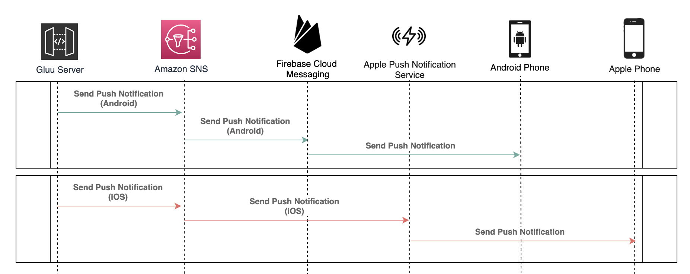

There are options to send to Google and Apple directly. However, GCM (Google Cloud Messaging) and p12 file are no longer supported.

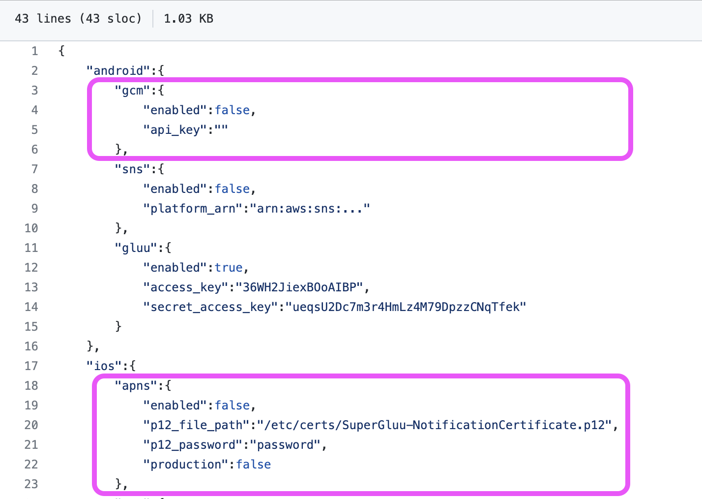

Therefore, AZPass attempts to provide up-to-date Helper classes to send push notification directly to FCM and APNs. 

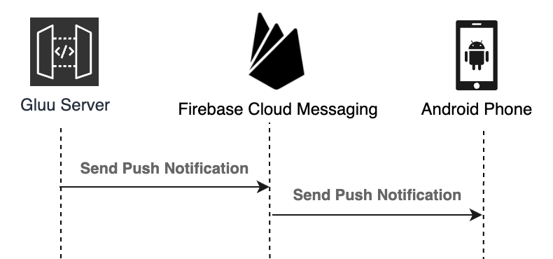

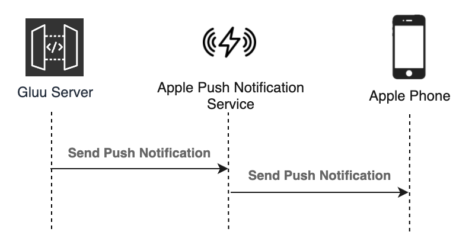

# Credentials

The file *super_gluu_creds.json* should be saved in */etc/conf*.
```json
{
  "android":{
    "fcm":{
      "enabled":true,
      "project_id":"azpass-ca7cea",
      "adminsdk_file_path":"/etc/certs/azpass-ca7ce-firebase-adminsdk.json"
    }
  },
  "ios":{
    "apns":{
      "enabled":true,
      "team_id":"QSH6DW32Z8",
      "key_id":"97KB2THZ38",
      "apns_host":"PRODUCTION",
      "apns_topic":"sg.azpass",
      "p8_file_path":"/etc/certs/AuthKey_97KB2THZ38.p8"
    }
  }
}

```
# Deploy 

> **_NOTE:_** Upload the JAR files from *lib* directory in this repo. Some libraries are not up-to-date, but they are required in order to work with Gluu 4.2.3. **DO NOT** use latest libraries.  

``` 
  [root@sso ~]# gluu-serverd login

  [root@sso ~]# mkdir /tmp/lib/
  [root@sso ~]# cp *.jar /tmp/lib/

  [root@sso ~]# mkdir /tmp/workspace/
  [root@sso ~]# cp /opt/gluu/jetty/oxauth/webapps/oxauth.war /tmp/workspace/
  [root@sso ~]# cd /tmp/workspace/
  [root@sso workspace]# jar -xf oxauth.war
  [root@sso workspace]# rm oxauth.war
  [root@sso workspace]# cp /tmp/lib/*.jar /tmp/workspace/WEB-INF/lib/
  [root@sso workspace]# jar -cvf oxauth.war ./*
  [root@sso workspace]# cp oxauth.war /opt/gluu/jetty/oxauth/webapps/

```

# Configure

1. Remove *notification_service_mode*
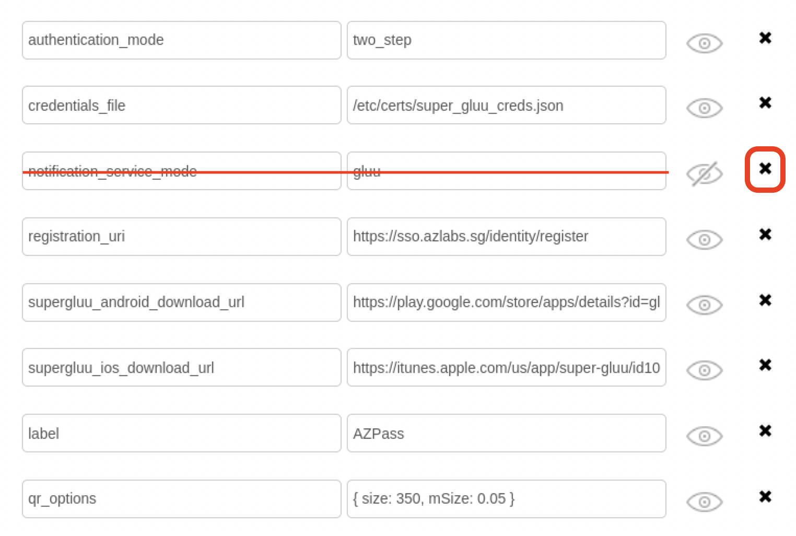

2. Add *credentials_file*. Value */etc/conf/super_gluu_creds.json*
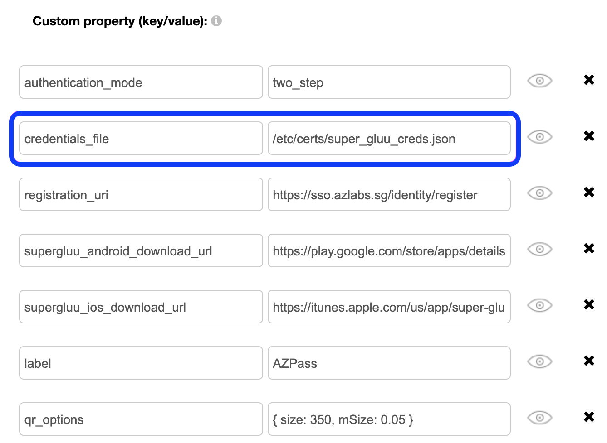

3. Copy content of `SuperGluuExternalAuthenticator.py` in this repo and replace it with the existing *super_gluu* interception script.


``` 

  [root@sso ~]# systemctl restart oxauth

```

# Debug

The interception script logs useful information to *oxauth_script.log* for debugging. For a start, if you see *Android FCMHelper initialized* and *Apple APNSHelper initialized*, you can be assured the FCM and APNS modules are loaded.  
```

[root@sso ~]# tail -f /opt/gluu/jetty/oxauth/logs/oxauth_script.log

oxauth_script.log:2021-09-17 18:04:49,081 INFO  [oxAuthScheduler_Worker-4] [org.gluu.service.PythonService$PythonLoggerOutputStream] (PythonService.java:243) - Super-Gluu. Initialize native notification services. Android FCMHelper initialized

oxauth_script.log:2021-09-17 19:17:55,218 INFO  [ForkJoinPool.commonPool-worker-3] [org.gluu.service.PythonService$PythonLoggerOutputStream] (PythonService.java:243) - Super-Gluu. Initialize native notification services. Apple APNSHelper initialized

```

# Mobile App

We work with another local company (IC.SG) to customize the look-and-feel of Super Gluu. We rebrand it as **AZPass**.

The repos for **AZPass** are in:
1. https://github.com/Identiticoders/android-super-gluu
2. https://github.com/Identiticoders/ios-super-gluu

Both are forks from: 
1. https://github.com/GluuFederation/android-super-gluu
2. https://github.com/GluuFederation/ios-super-gluu


# Login Flow

When Super Gluu (AZPass) is enabled on Gluu Server, this is how the login page will look like.

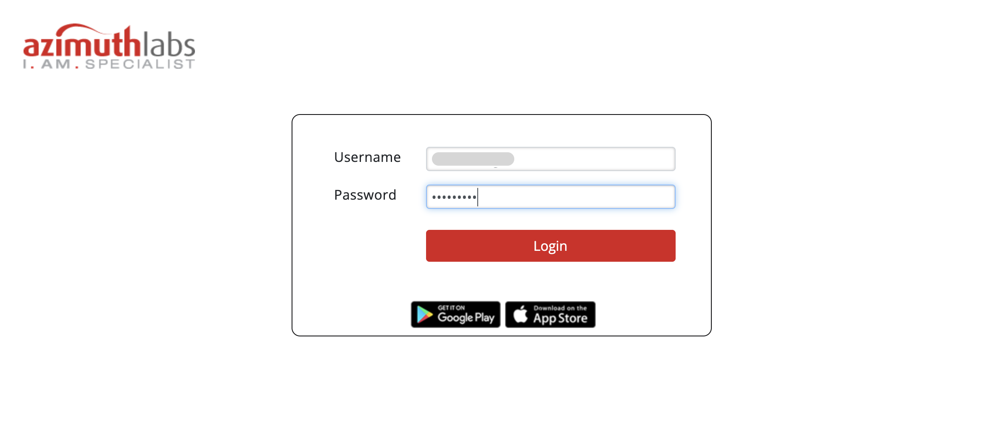


After user name and password are keyed in, the user is prompted with the following message.

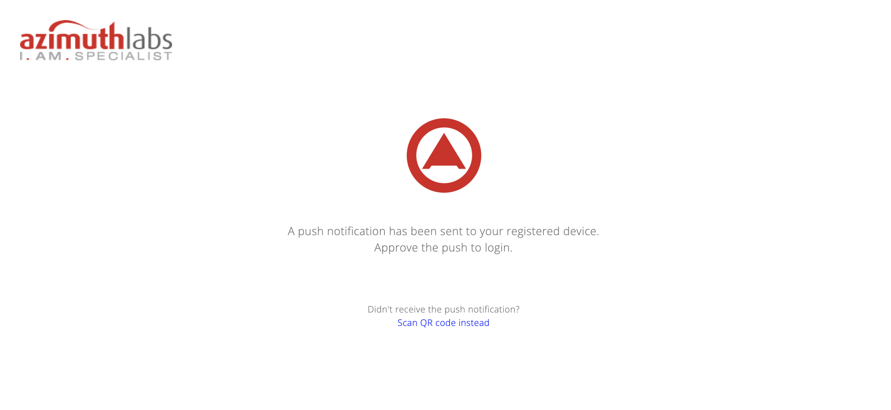


A push notification will arrive on the user's mobile phone.

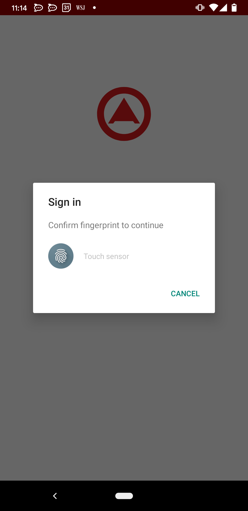


User clicks on the Approve button.

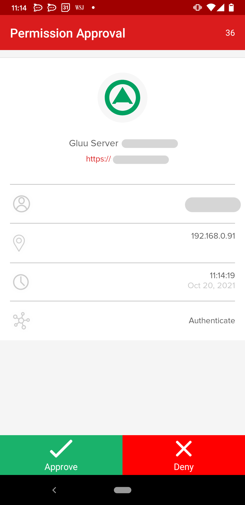

User is successfully authenticated.

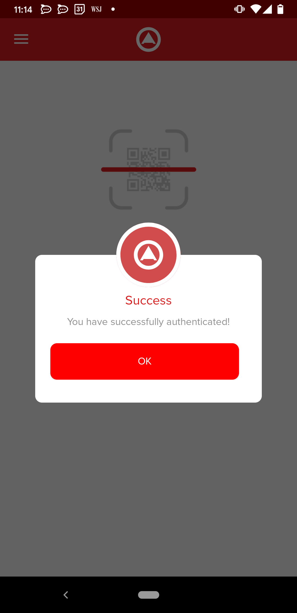
